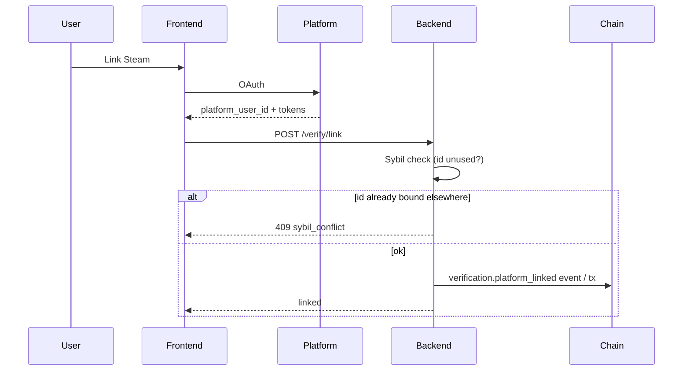

# Verification

Platform linking for **Act 3** of [onboarding](./onboarding.md). Verified links unlock achievement-sourced badges and channel eligibility; they are also the sybil backbone for one-person-one-passport.

---

## Principles

1. **Proof, not typing** — Users never paste handles. Link flows use OAuth or platform APIs that return a stable platform user id.
2. **One platform id → one Passport** — Permanent. A Steam account that verified Passport A cannot verify Passport B (new or old).
3. **Timestamp anchor** — Only achievements with timestamps **≥ `Passport.created_at_ms`** are claimable. Pre-passport grind does not count.
4. **Unlink is lossy** — Unlinking removes badges that depended on that platform and triggers XP/reputation recalculation. Relinking does **not** restore removed badges.
5. **Game channels need ownership** — Verified Game Channel badge programs require platform link **plus** provable game ownership (see [channel-badge-programs.md](./channel-badge-programs.md)).

---

## Supported platforms (target)

| Platform | Proof method | Notes |
|----------|--------------|-------|
| Phone | SMS / OTP | Optional; sybil signal |
| X (Twitter) | OAuth 2 | Public profile id |
| Steam | OpenID / Web API | Library + achievements |
| Epic | Epic Online Services | Ownership + achievements |
| Xbox | Microsoft identity | Gamertag + title history |

Exact OAuth apps and indexer fields TBD per environment.

---

## Link flow

### Sybil modal (link)

Before OAuth completes, show:

- This account can only ever verify **one** Nami Passport.
- If you used it on another passport (including deleted), link will fail.

---

## Unlink flow

### Unlink modal

- Badges earned via this platform will be **removed**.
- XP and reputation will be **recalculated** (may decrease).
- Relinking later will **not** restore removed badges.
- Achievements remain on the platform; only Nami attribution changes.

### On-chain / indexer

Emit `verification.platform_unlinked` with `platform`, `platform_user_id`, `passport_id`, and list of revoked badge ids (computed from projections).

---

## Achievement → badge rules

| Rule | Detail |
|------|--------|
| Eligibility window | `achievement.unlocked_at >= passport.created_at_ms` |
| Source of truth | Platform API or signed webhook; not user uploads |
| Mapping | Platform achievement id → Nami badge definition (catalog) |
| Channel programs | Game-specific mappings from owner questionnaire ([channel-badge-programs.md](./channel-badge-programs.md)) |

---

## Verified Game Channel owners

Additional gates beyond personal verification:

1. Platform account linked and sybil-clear.
2. **Ownership proof** for the game title (Steam/Epic/Xbox APIs).
3. **Eligibility review** — anti-shovelware / minimum quality bar before `BadgeIssuerCap` with `ISSUER_VERIFIED_CHANNEL`.
4. **Badge program form** — owner submits which achievements issue which badges (questionnaire); campaign approval before mint.

---

## Projection / API (Phase 2+)

`Identity` / `Profile` protocol views should expose:

- `linkedPlatforms: { platform, verifiedAtMs, displayHandle? }[]`
- `sybilLocked: boolean` per platform family

Frontend: `ProtocolIdentityPanel`, Settings → Identity.

---

## Security notes

- Store refresh tokens encrypted; never log secrets.
- Rate-limit link attempts per passport and per IP.
- Audit log all link/unlink with platform id hash for support.

---

## Related

- [onboarding.md](./onboarding.md) — three-act flow
- [channel-badge-programs.md](./channel-badge-programs.md) — game channel questionnaires
- [badge-system.md](./badge-system.md) — badge types and revocation
- [events.md](./events.md) — `verification.*` events